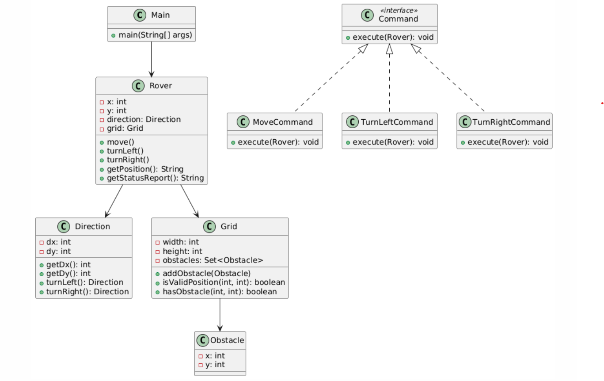

# Mars Rover Simulation

## Overview
This project simulates a Mars Rover navigating a grid-based terrain. The Rover can move forward, turn left, and turn right while avoiding obstacles and staying within the boundaries of the grid.

### Class Diagram


## Table of Contents
- [Features](#features)
- [Technologies Used](#technologies-used)
- [Architecture](#architecture)
- [Instructions](#instructions)
- [Usage](#usage)


## Features
- Initialize the Rover with a starting position and direction.
- Commands for movement (`M`), turning left (`L`), and turning right (`R`).
- Obstacle detection to prevent collisions.
- Status report displaying current position and facing direction.

## Technologies Used
- Java
- Object-Oriented Programming (OOP)
- Design Patterns: Command Pattern, Composite Pattern
- Git for version control

## Architecture
The project is organized into several packages:

- **commands**: Contains command classes (`MoveCommand`, `TurnLeftCommand`, `TurnRightCommand`) that implement the `Command` interface.
- **grid**: Manages the grid and obstacles (`Grid`, `Obstacle` classes).
- **rover**: Contains the `Rover` class and `Direction` enum for handling rover operations.


## Instructions
1. Clone the repository:
   ```bash
   git clone <repository-url>
   ```
2. Navigate to the project directory:
   ```bash
   cd EIAssignment
   ```
3. Compile the Java files:
   ```bash
   javac -d bin src/**/*.java
   ```
4. Run the main class:
   ```bash
   java -cp bin Main
   ```

## Usage
- Input the grid size when prompted.
- Input the number of obstacles and their coordinates.
- Input the starting position and direction of the rover.
- Enter commands (`M`, `L`, `R`) to control the rover.

### Example Input
```
Enter grid width: 10
Enter grid height: 10
Enter number of obstacles: 2
Enter obstacle 1 x coordinate: 2
Enter obstacle 1 y coordinate: 2
Enter obstacle 2 x coordinate: 3
Enter obstacle 2 y coordinate: 5
Enter rover starting x coordinate: 0
Enter rover starting y coordinate: 0
Enter rover starting direction (N, E, S, W): N
```

### Example Output
```
Current Position: (1, 3, EAST)
Rover is at (1, 3) facing East. No obstacles detected.
Final Position: (1, 3, EAST)
```

