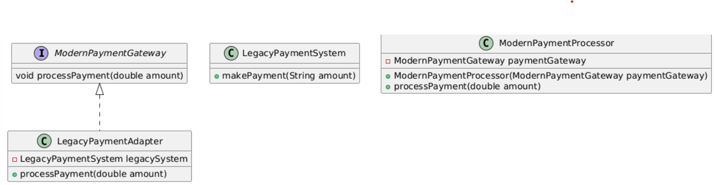

# Task:1 Design Patterns Demo

## Introduction

This project serves as a comprehensive demonstration of several software design patterns implemented in Java. It aims to provide a clear and concise understanding of how these design patterns can be applied to real-world scenarios, showcasing their benefits and practical usage.

## Design Patterns Implemented

The project covers the following design patterns:

1. **Behavioral Patterns**:
   - **Observer Pattern**: Implemented in the `com.designpatterns.behavioral.observer` package. The use case is a Stock Market Notification System.
     
    
   
   - **Strategy Pattern**: Implemented in the `com.designpatterns.behavioral.strategy` package. The use case is a Payment Processing System.
     
     
     

3. **Creational Patterns**:
   - **Factory Pattern**: Implemented in the `com.designpatterns.creational.factory` package. The use case is a Vehicle Manufacturing System.
     
   - 
     
   - **Builder Pattern**: Implemented in the `com.designpatterns.creational.builder` package. The use case is a Custom Computer Configuration System.
     
   - 
     

4. **Structural Patterns**:
   - **Adapter Pattern**: Implemented in the `com.designpatterns.structural.adapter` package. The use case is a Legacy Payment System Integration.
     
   - 
     
   - **Decorator Pattern**: Implemented in the `com.designpatterns.structural.decorator` package. The use case is a Coffee Ordering System.
     
   - 
     

## Features

- Comprehensive implementation of six design patterns in Java
- Real-world use cases for each design pattern
- Well-structured and modular code organization
- Intuitive command-line interface for demonstrating the patterns
- Extensible and customizable design to allow for future additions

## Getting Started

To run the Design Patterns Demo project, follow these steps:

1. Ensure you have Java Development Kit (JDK) version 8 or higher installed on your system.
2. Clone the repository or download the source code.
3. Open the project in your preferred Java IDE (e.g., IntelliJ IDEA, Eclipse, or Visual Studio Code).
4. Build the project and resolve any dependencies.
5. Run the `Main.java` file located in the `com.designpatterns` package.
6. The console will display a menu with options to choose from. Enter the corresponding number to run the demo for each design pattern.

## Usage

When running the project, the console will display a menu with the following options:

1. Observer Pattern (Stock Market)
2. Strategy Pattern (Payment Processing)
3. Factory Pattern (Vehicle Manufacturing)
4. Builder Pattern (Computer Configuration)
5. Adapter Pattern (Legacy Payment System)
6. Decorator Pattern (Coffee Ordering)
0. Exit

Select the desired option by entering the corresponding number. The selected design pattern demo will be executed, and you can observe the output in the console. After each demo, press Enter to return to the main menu.

# Task 2: Mars Rover Simulation [Mini Project]

## Overview
This project simulates a Mars Rover navigating a grid-based terrain. The Rover can move forward, turn left, and turn right while avoiding obstacles and staying within the boundaries of the grid.

### Class Diagram


## Table of Contents
- [Features](#features)
- [Technologies Used](#technologies-used)
- [Architecture](#architecture)
- [Instructions](#instructions)
- [Usage](#usage)


## Features
- Initialize the Rover with a starting position and direction.
- Commands for movement (`M`), turning left (`L`), and turning right (`R`).
- Obstacle detection to prevent collisions.
- Status report displaying current position and facing direction.

## Technologies Used
- Java
- Object-Oriented Programming (OOP)
- Design Patterns: Command Pattern, Composite Pattern
- Git for version control

## Architecture
The project is organized into several packages:

- **commands**: Contains command classes (`MoveCommand`, `TurnLeftCommand`, `TurnRightCommand`) that implement the `Command` interface.
- **grid**: Manages the grid and obstacles (`Grid`, `Obstacle` classes).
- **rover**: Contains the `Rover` class and `Direction` enum for handling rover operations.


## Instructions
1. Clone the repository:
   ```bash
   git clone <repository-url>
   ```
2. Navigate to the project directory:
   ```bash
   cd EIAssignment
   ```
3. Compile the Java files:
   ```bash
   javac -d bin src/**/*.java
   ```
4. Run the main class:
   ```bash
   java -cp bin Main
   ```

## Usage
- Input the grid size when prompted.
- Input the number of obstacles and their coordinates.
- Input the starting position and direction of the rover.
- Enter commands (`M`, `L`, `R`) to control the rover.

### Example Input
```
Enter grid width: 10
Enter grid height: 10
Enter number of obstacles: 2
Enter obstacle 1 x coordinate: 2
Enter obstacle 1 y coordinate: 2
Enter obstacle 2 x coordinate: 3
Enter obstacle 2 y coordinate: 5
Enter rover starting x coordinate: 0
Enter rover starting y coordinate: 0
Enter rover starting direction (N, E, S, W): N
```

### Example Output
```
Current Position: (1, 3, EAST)
Rover is at (1, 3) facing East. No obstacles detected.
Final Position: (1, 3, EAST)
```

